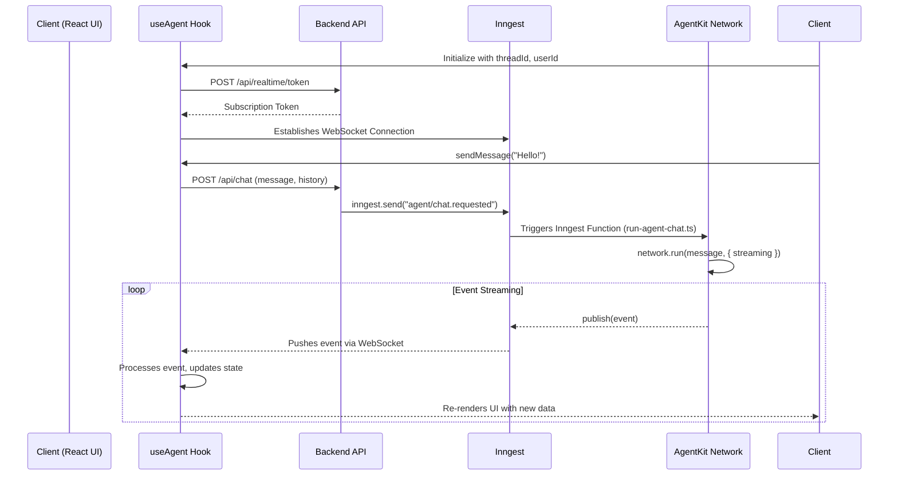

# UI Streaming with useAgent

> Stream AgentKit events to your UI with the useAgent hook.

The `useAgent` hook is a powerful client-side hook for React that manages real-time, multi-threaded conversations with an AgentKit network. It encapsulates the entire lifecycle of agent interactions, including sending messages, receiving streaming events, handling out-of-order event sequences, and managing connection state.

While `useChat` is the recommended high-level hook for building chat interfaces, `useAgent` provides the low-level building blocks for more customized implementations where you need direct control over the event stream and state management.

    Find the complete source code for a Next.js chat application using
    `useAgent` on GitHub.

## How it Works

`useAgent` builds upon Inngest's Realtime capabilities to create a persistent, unified stream of events for a user. Here’s a step-by-step breakdown of the data flow:

1. **Client Initialization**: The `useAgent` hook is initialized in your React component. It uses the `useInngestSubscription` hook from `@inngest/realtime/hooks` to establish a WebSocket connection.
2. **Authentication**: To connect, it calls a backend API route (e.g., `/api/realtime/token`) to get a short-lived subscription token. This token authorizes the client to listen to events on a specific user channel.
3. **Sending a Message**: The user types a message and the UI calls the `sendMessage` function returned by the hook.
4. **API Request**: `sendMessage` makes a `POST` request to a backend API route (e.g., `/api/chat`). This request contains the message content, the current `threadId`, and the conversation history.
5. **Triggering Inngest**: The chat API route receives the request and sends an `agent/chat.requested` event to Inngest using `inngest.send()`.
6. **Agent Execution**: An Inngest function (`run-agent-chat.ts` in our example) is triggered by the event. It sets up the AgentKit network, state, and history adapter.
7. **Running the Network**: The Inngest function calls `network.run(message, { streaming: ... })`.
8. **Streaming Events**: As the network and its agents execute, they generate streaming events (e.g., `run.started`, `part.created`, `text.delta`). The `streaming.publish` function inside the Inngest function forwards these events back to the user's realtime channel.
9. **Realtime Push**: The events are pushed over the WebSocket connection to the client.
10. **State Update**: `useAgent` receives the raw events, processes them in the correct sequence, handles out-of-order events, and updates its internal state.
11. **UI Re-render**: The component using the hook re-renders with the new messages, agent status, and other UI parts.

### Sequence Diagram



## Usage Guide

### 1. Backend Setup

First, you need to set up the backend infrastructure to handle chat requests and realtime communication.

#### Inngest Function

This function is the core of your agent's execution. It listens for chat requests and runs your AgentKit network, streaming events back to the client.

```ts title="inngest/functions/run-agent-chat.ts" theme={"system"}
import { inngest } from "../client";
import { createCustomerSupportNetwork } from "../networks/customer-support-network";
import { userChannel } from "../../lib/realtime";
import { createState } from "@inngest/agent-kit";
import type { CustomerSupportState } from "../types/state";
import { PostgresHistoryAdapter } from "../db";

const historyAdapter = new PostgresHistoryAdapter<CustomerSupportState>({});

export const runAgentChat = inngest.createFunction(
  { id: "run-agent-chat" },
  { event: "agent/chat.requested" },
  async ({ event, step, publish }) => {
    await step.run("initialize-db-tables", () =>
      historyAdapter.initializeTables()
    );

    const { threadId, message, userId, history, messageId } = event.data;

    const network = createCustomerSupportNetwork(
      threadId,
      createState<CustomerSupportState>(
        { customerId: userId },
        { messages: history, threadId }
      ),
      historyAdapter
    );

    // Run the network and stream events back to the client
    const result = await network.run(message, {
      streaming: {
        publish: async (chunk) => {
          const enrichedChunk = {
            ...chunk,
            data: { ...chunk.data, threadId, userId },
          };
          await publish(userChannel(userId).agent_stream(enrichedChunk));
        },
      },
      messageId,
    });

    return { success: true, threadId, result };
  }
);
```

#### API Routes

You'll need a few API routes in your Next.js application.

```ts title="app/api/chat/route.ts" theme={"system"}
import { NextRequest, NextResponse } from "next/server";
import { inngest } from "@/inngest/client";
import { randomUUID } from "crypto";

export async function POST(req: NextRequest) {
  const {
    message,
    threadId: providedThreadId,
    userId,
    history,
    messageId,
  } = await req.json();
  const threadId = providedThreadId || randomUUID();

  await inngest.send({
    name: "agent/chat.requested",
    data: { threadId, message, messageId, history, userId },
  });

  return NextResponse.json({ success: true, threadId });
}
```

```ts title="app/api/realtime/token/route.ts" theme={"system"}
import { NextRequest, NextResponse } from "next/server";
import { getSubscriptionToken } from "@inngest/realtime";
import { inngest } from "@/inngest/client";
import { userChannel } from "@/lib/realtime";

export async function POST(req: NextRequest) {
  const { userId } = await req.json();
  // TODO: Add authentication/authorization here
  const token = await getSubscriptionToken(inngest, {
    channel: userChannel(userId),
    topics: ["agent_stream"],
  });
  return NextResponse.json(token);
}
```

### 2. Frontend Setup

Now, let's wire up the `useAgent` hook in a React component.

```tsx title="components/ChatComponent.tsx" theme={"system"}
"use client";

import { useAgent, type ConversationMessage } from "@/hooks/use-agent";

const USER_ID = "test-user-123";

export function ChatComponent({ threadId }: { threadId: string }) {
  const { messages, status, sendMessage, isConnected, error, clearError } =
    useAgent({
      threadId: threadId,
      userId: USER_ID,
      debug: true,
      onError: (err) => console.error("Agent error:", err),
    });

  const handleSubmit = (e: React.FormEvent<HTMLFormElement>) => {
    e.preventDefault();
    const formData = new FormData(e.currentTarget);
    const message = formData.get("message") as string;
    if (message.trim()) {
      sendMessage(message);
      e.currentTarget.reset();
    }
  };

  return (
    <div>
      <div>Status: {status}</div>
      <div>Connected: {isConnected ? "Yes" : "No"}</div>
      {error && (
        <div>
          Error: {error.message}
          <button onClick={clearError}>Clear</button>
        </div>
      )}

      <div className="message-list">
        {messages.map((msg) => (
          <Message key={msg.id} message={msg} />
        ))}
      </div>

      <form onSubmit={handleSubmit}>
        <input
          name="message"
          placeholder="Ask anything..."
          disabled={status !== "idle"}
        />
        <button type="submit" disabled={status !== "idle"}>
          Send
        </button>
      </form>
    </div>
  );
}

// A simple component to render a message with all its parts
function Message({ message }: { message: ConversationMessage }) {
  return (
    <div className={`message ${message.role}`}>
      <strong>{message.role}</strong>
      {message.parts.map((part, index) => {
        switch (part.type) {
          case "text":
            return <p key={index}>{part.content}</p>;
          case "tool-call":
            return (
              <div
                key={index}
                className="tool-call"
                style={{
                  border: "1px solid #ccc",
                  padding: "10px",
                  marginTop: "10px",
                  borderRadius: "5px",
                }}
              >
                <div>
                  <strong>Tool Call:</strong> {part.toolName}
                </div>
                <pre style={{ whiteSpace: "pre-wrap", wordBreak: "break-all" }}>
                  Status: {part.state}
                  <br />
                  Input: {JSON.stringify(part.input, null, 2)}
                  {part.output && (
                    <>
                      <br />
                      Output: {JSON.stringify(part.output, null, 2)}
                    </>
                  )}
                </pre>
              </div>
            );
          // TODO: Add cases for other part types like 'data', 'reasoning', etc.
          default:
            return null;
        }
      })}
    </div>
  );
}
```

## API Reference

The `useAgent` hook returns an object with the following properties and methods.

### State Properties

**messages** `ConversationMessage[]`
  The array of messages for the **current thread**. Each message contains an
  array of `parts` that are streamed in real-time.

**status** `AgentStatus`
  The current status of the agent for the active thread. It can be one of:
  `"idle"`, `"thinking"`, `"calling-tool"`, `"responding"`, or `"error"`.

**error** `{ message: string; ... } | undefined`
  An object containing details about the last error that occurred in the active
  thread. `undefined` if there is no error.

**threads** `Record<string, ThreadState>`
  An object containing the full state for all active threads, indexed by
  `threadId`. This allows you to manage multiple conversations in the
  background.

**currentThreadId** `string`
  The ID of the currently active/displayed thread.

**isConnected** `boolean`
  `true` if the client is currently connected to the Inngest Realtime server.

**connectionError** `{ message: string; ... } | undefined`
  An object containing details about a connection-level error (e.g., failure to
  get a subscription token).

### Action Methods

**sendMessage** `(message: string) => Promise<void>`
  Sends a message to the **current thread**. It handles optimistic UI updates
  and formats the history for the backend.

**sendMessageToThread** `(threadId: string, message: string) => Promise<void>`
  Sends a message to a **specific thread**, which can be different from the
  currently active one.

**setCurrentThread** `(threadId: string) => void`
  Switches the active thread. This updates which thread's state is exposed via
  the top-level `messages`, `status`, and `error` properties.

**createThread** `(threadId: string) => void`
  Creates a new, empty thread in the local state.

**clearMessages** `() => void`
  Clears all messages from the **current thread's** local state.

**replaceMessages** `(messages: ConversationMessage[]) => void`
  Replaces all messages in the **current thread's** local state. Useful for
  loading historical messages.

**clearError** `() => void`
  Clears the error state for the **current thread**.

**clearConnectionError** `() => void`
  Clears any connection-level error.

## UI Data Models

The `useAgent` hook exposes a set of rich UI data models to make building chat interfaces easier. These types define the structure of messages and their constituent parts.

### ConversationMessage

Represents a complete message in the conversation, containing one or more parts.

```typescript
export interface ConversationMessage {
  /** Unique identifier for this message */
  id: string;
  /** Whether this message is from the user or the assistant */
  role: "user" | "assistant";
  /** Array of message parts that make up the complete message */
  parts: MessagePart[];
  /** ID of the agent that created this message (for assistant messages) */
  agentId?: string;
  /** When this message was created */
  timestamp: Date;
  /** The status of the message, particularly for optimistic user messages */
  status?: "sending" | "sent" | "failed";
}
```

### MessagePart

A union type representing all possible parts of a message.

```typescript
export type MessagePart =
  | TextUIPart
  | ToolCallUIPart
  | DataUIPart
  | FileUIPart
  | SourceUIPart
  | ReasoningUIPart
  | StatusUIPart
  | ErrorUIPart
  | HitlUIPart;
```

### TextUIPart

Represents a text message part that can be streamed character by character.

```typescript
export interface TextUIPart {
  type: "text";
  /** Unique identifier for this text part */
  id: string;
  /** The text content, updated incrementally during streaming */
  content: string;
  /** Whether the text is still being streamed or is complete */
  status: "streaming" | "complete";
}
```

### ToolCallUIPart

Represents a tool call that the agent is making, with streaming input and output.

```typescript
export interface ToolCallUIPart {
  type: "tool-call";
  /** Unique identifier for this tool call */
  toolCallId: string;
  /** Name of the tool being called */
  toolName: string;
  /** Current state of the tool call execution */
  state:
    | "input-streaming"
    | "input-available"
    | "awaiting-approval"
    | "executing"
    | "output-available";
  /** Tool input parameters, streamed incrementally */
  input: any;
  /** Tool output result, if available */
  output?: any;
  /** Error information if the tool call failed */
  error?: any;
}
```

*(For brevity, other part types like `DataUIPart`, `ReasoningUIPart`, etc., are omitted here but follow a similar structure. You can find their full definitions in the `use-agent.ts` file in the example.)*

### AgentStatus

Represents the current activity status of the agent.

```typescript
export type AgentStatus =
  | "idle"
  | "thinking"
  | "calling-tool"
  | "responding"
  | "error";
```
