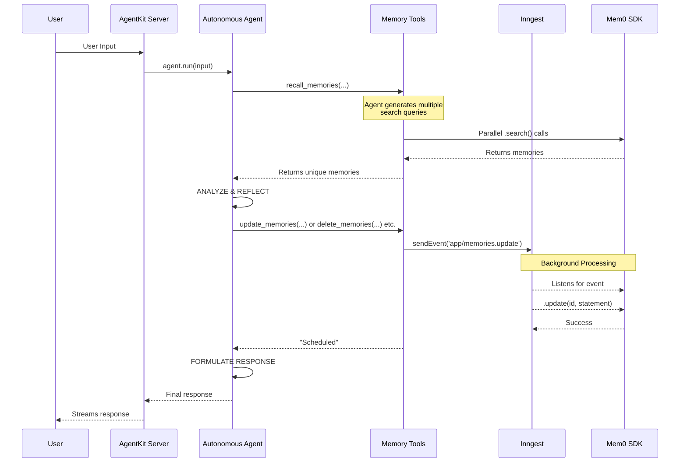
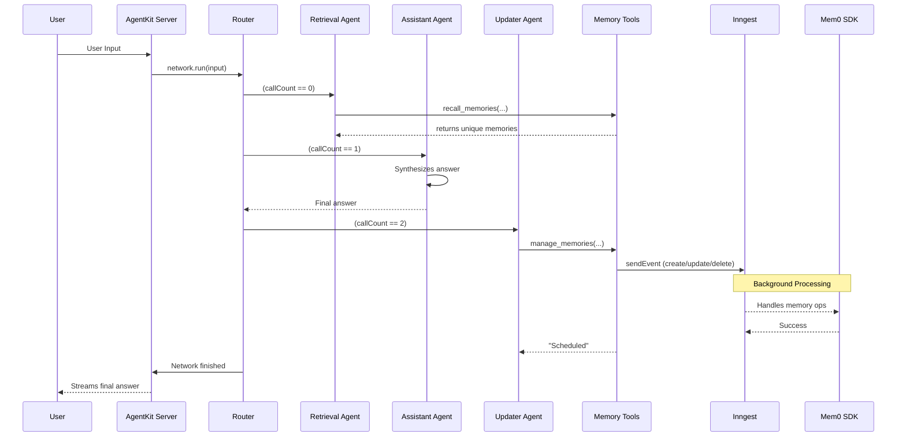

# Memory

> Learn how to give your agents long-term, reflective memory using Mem0.

## Overview

AgentKit allows you to equip your agents with long-term memory, enabling them to recall past interactions, learn user preferences, and maintain context across conversations. By integrating with [Mem0](https://docs.mem0.ai/overview), you can build sophisticated agents that offer personalized and context-aware experiences.

A key advantage of combining Mem0 with AgentKit is the power of Inngest for handling memory operations. When an agent needs to create, update, or delete a memory, it can send an event to Inngest for durable background processing. This means:

    Your agent can respond to the user immediately, without waiting for database
    writes to complete.

    The memory operation runs reliably in the background as a separate, durable
    Inngest function. If it fails, Inngest automatically retries it.

## Memory Tools

To empower your agent with memory, you need to provide it with tools. How you design these tools can significantly impact your agent's behavior, performance, and reliability. AgentKit supports multiple patterns for memory tools, allowing you to choose the best fit for your use case.

The core idea is to abstract memory operations (create, read, update, delete) into tools that an agent can call. These tools can then use Inngest to perform the actual database writes asynchronously, ensuring the agent remains responsive.

```typescript
// From examples/mem0-memory/memory-tools.ts

const createMemoriesTool = createTool({
  name: "create_memories",
  description: "Save one or more new pieces of information to memory.",
  parameters: z.object({
    statements: z
      .array(z.string())
      .describe("The pieces of information to memorize."),
  }),
  handler: async ({ statements }, { step }) => {
    // 1. Send an event to an Inngest function for background processing
    await step?.sendEvent("send-create-memories-event", {
      name: "app/memories.create",
      data: {
        statements,
      },
    });
    // 2. Return immediately to the user
    return `I have scheduled the creation of ${statements.length} new memories.`;
  },
});

// A separate Inngest function handles the event
const addMemoriesFn = inngest.createFunction(
  { id: "add-memories" },
  { event: "app/memories.create" },
  async ({ event }) => {
    // 3. Perform the durable memory operation
    const { statements } = event.data;
    await mem0.add(statements.map((s) => ({ role: "user", content: s })));
    return { status: `Added ${statements.length} memories.` };
  }
);
```

Let's explore two common patterns for designing and integrating these tools into agents.

### Pattern 1: Granular, Single-Purpose Tools

This pattern involves creating a distinct tool for each memory operation:

* `create_memories`: Adds new information.
* `recall_memories`: Retrieves existing information.
* `update_memories`: Corrects or changes existing information.
* `delete_memories`: Removes information.

This gives the agent fine-grained control, but requires it to make more decisions and more tool calls.

Here's how you might define the `recall_memories` and `create_memories` tools:

```typescript
// From examples/voice-assistant/tools/memory.ts

const recallMemoriesTool = createTool({
  name: "recall_memories",
  description: `Recall memories relevant to one or more queries. Can run multiple queries in parallel.`,
  parameters: z.object({
    queries: z
      .array(z.string())
      .describe(
        `The questions to ask your memory to find relevant information.`
      ),
  }),
  handler: async ({ queries }, { step, network }) => {
    // ... implementation to search memories ...
  },
});

const createMemoriesTool = createTool({
  name: "create_memories",
  description: "Save one or more new pieces of information to memory.",
  parameters: z.object({
    statements: z
      .array(z.string())
      .describe("The pieces of information to memorize."),
  }),
  handler: async ({ statements }, { step }) => {
    await step?.sendEvent("send-create-memories-event", {
      name: "app/memories.create",
      data: { statements },
    });
    return `I have scheduled the creation of ${statements.length} new memories.`;
  },
});
```

This approach is used in the **Autonomous Agent** pattern described below, where a single, powerful LLM is prompted to reason about which of the specific tools to use at each turn.

### Pattern 2: Consolidated Tools

This pattern simplifies the agent's job by consolidating write operations into a single tool.

* `recall_memories`: Same as above, for reading.
* `manage_memories`: A single tool that handles creating, updating, *and* deleting memories in one atomic action.

This reduces the number of tools the agent needs to know about and can make its behavior more predictable. It's particularly effective in structured, multi-agent workflows.

The `manage_memories` tool can accept lists of creations, updates, and deletions, and then send corresponding events to Inngest.

```typescript
// From examples/voice-assistant/tools/memory.ts

const manageMemoriesTool = createTool({
  name: "manage_memories",
  description: `Create, update, and/or delete memories in a single atomic operation. This is the preferred way to modify memories.`,
  parameters: z.object({
    creations: z
      .array(z.string())
      .optional()
      .describe("A list of new statements to save as memories."),
    updates: z
      .array(
        z.object({
          id: z.string().describe("The unique ID of the memory to update."),
          statement: z
            .string()
            .describe("The new, corrected information to save."),
        })
      )
      .optional()
      .describe("A list of memories to update."),
    deletions: z
      .array(
        z.object({
          id: z.string().describe("The unique ID of the memory to delete."),
        })
      )
      .optional()
      .describe("A list of memories to delete."),
  }),
  handler: async ({ creations, updates, deletions }, { step }) => {
    // Send events to Inngest for background processing
    if (creations?.length) {
      await step?.sendEvent("create-memories", {
        name: "app/memories.create",
        data: { statements: creations },
      });
    }
    if (updates?.length) {
      await step?.sendEvent("update-memories", {
        name: "app/memories.update",
        data: { updates },
      });
    }
    if (deletions?.length) {
      await step?.sendEvent("delete-memories", {
        name: "app/memories.delete",
        data: { deletions },
      });
    }
    return `Scheduled memory operations.`;
  },
});
```

This consolidated `manage_memories` tool is a perfect fit for a **multi-agent network**, where a dedicated "Memory Updater" agent has the single, clear responsibility of calling this tool at the end of a conversation - only running once with a tool that can emit many events / memory operations.

***

## Deterministic vs Non-Deterministic Memory

There are two primary patterns for integrating memory into your agents:

1. **Autonmous Agent w/ Tools (Non-Deterministic):** A single, powerful agent is given memory-related tools and decides for itself when and how to use them based on its system prompt and the conversation. This approach offers maximum flexibility and autonomy.
2. **Multi-Agent or Lifecycle-based (Deterministic):** The process is broken down into a structured sequence of specialized agents (e.g., one for retrieval, one for responding, one for updating memory), orchestrated by a code-based router. This approach provides predictability and control.

Let's explore both!

### Pattern 1: Autonomous Agent with Memory Tools

In this setup, a single agent is responsible for all tasks. Its system prompt instructs it to follow a **recall-reflect-respond** process. The agent uses its own reasoning (powered by the LLM) to decide which memory tool to use, making the flow non-deterministic.

#### Example Agent

Here is an agent designed to manage its own memory. Note the detailed system prompt guiding its behavior.

```typescript
// From examples/mem0-memory/index.ts
const mem0Agent = createAgent({
  name: "reflective-mem0-agent",
  description:
    "An agent that can reflect on and manage its memories using mem0.",
  system: `
    You are an assistant with a dynamic, reflective memory. You must actively manage your memories to keep them accurate
    and strategically for search queries to retrieve the most relevant memories related to the user and their query.

    On every user interaction, you MUST follow this process:
    1.  **RECALL**: Use the 'recall_memories' tool with a list of queries relevant to the user's input to get context.
    2.  **ANALYZE & REFLECT**:
        - Compare the user's new statement with the memories you recalled.
        - If there are direct contradictions, you MUST use the 'update_memories' tool to correct the old memories.
        - If old memories are now irrelevant or proven incorrect based on the discussion, you MUST use the 'delete_memories' tool.
        - If this is brand new information that doesn't conflict, you may use the 'create_memories' tool.
    3.  **RESPOND**: Never make mention to the user of any memory operations you have executed.
`,
  tools: [
    createMemoriesTool,
    recallMemoriesTool,
    updateMemoriesTool,
    deleteMemoriesTool,
  ],
  model: openai({ model: "gpt-4o" }),
});
```

#### Execution Flow

The agent's internal monologue drives the process, deciding which tools to call in sequence.



Pros:

* **Flexibility & Autonomy:** The agent can handle unforeseen scenarios by reasoning about which tools to use.

* **Simpler Setup:** Requires only one
  agent and a comprehensive prompt.

Cons:

* **Unpredictability:** The agent's behavior can be inconsistent. It might
  get stuck in loops, call tools in the wrong order, or fail to answer the
  user's question directly.

* **Complex Prompting:** The system prompt must be
  carefully engineered to cover all cases, which can be brittle and hard to
  maintain.

### Pattern 2: Multi-Agent Network for Memory

To address the unpredictability of a single autonomous agent, you can use a deterministic, multi-agent network. The workflow is broken down into a sequence of specialized agents orchestrated by a [code-based router](https://agentkit.inngest.com/concepts/routers#code-based-routers-supervised-routing).

#### Example Agents & Router

The process is divided into three distinct steps, each handled by a dedicated agent:

1. **Memory Retrieval Agent**: Its sole job is to use the `recall_memories` tool.
2. **Personal Assistant Agent**: Has no tools. Its only job is to synthesize the final answer for the user based on the retrieved memories and history.
3. **Memory Updater Agent**: Reviews the *entire* conversation and uses a `manage_memories` tool to perform all necessary creations, updates, and deletions in one go.

```typescript
// From examples/mem0-memory/multi-agent.ts

// 1. Retrieval Agent
const memoryRetrievalAgent = createAgent({
  name: "memory-retrieval-agent",
  description: "Retrieves relevant memories based on the user query.",
  system: `Your only job is to use the 'recall_memories' tool. ...`,
  tools: [recallMemoriesTool],
  // ...
});

// 2. Assistant Agent
const personalAssistantAgent = createAgent({
  name: "personal-assistant-agent",
  description: "A helpful personal assistant that answers user questions.",
  system: `Answer the user's question based on the conversation history...`,
  // No tools
  // ...
});

// 3. Updater Agent
const memoryUpdaterAgent = createAgent({
  name: "memory-updater-agent",
  description: "Reflects on the conversation and updates memories.",
  system: `Analyze the entire conversation history... you MUST use the 'manage_memories' tool...`,
  tools: [manageMemoriesTool],
  // ...
});

// The Router enforces the sequence
const multiAgentMemoryNetwork = createNetwork({
  name: "multi-agent-memory-network",
  agents: [memoryRetrievalAgent, personalAssistantAgent, memoryUpdaterAgent],
  router: async ({ callCount }) => {
    if (callCount === 0) return memoryRetrievalAgent;
    if (callCount === 1) return personalAssistantAgent;
    if (callCount === 2) return memoryUpdaterAgent;
    return undefined; // Stop the network
  },
  // ...
});
```

#### Execution Flow

The router guarantees a predictable, step-by-step execution path.



Pros:

* **Predictability & Control:** The workflow is explicit and reliable. Each
  agent has a single, well-defined responsibility.

* **Maintainability:** It's
  easier to debug and modify a specific part of the process without affecting
  the others.

Cons:

* **More Boilerplate:** Requires defining multiple agents and a router,
  which can be more verbose for simple use cases.

* **Less Flexible:** The
  rigid structure may not adapt as well to unexpected conversational turns
  compared to an autonomous agent which can determine on its own - when memories should be retrieved.

***

## Advanced Patterns

### State-Based Memory Retrieval / Routing

Instead of `callCount`, you can use the network state to create more flexible and explicit routing logic. This is powerful when different agents have different memory needs.

```typescript
// Define your network state interface
interface NetworkState {
  memoriesRetrieved?: boolean;
  assistantResponded?: boolean;
}

// Use state-based routing
const network = createNetwork<NetworkState>({
  //...
  router: async ({ network }) => {
    const state = network.state.data;

    if (!state.memoriesRetrieved) {
      // In a real implementation, the agent's tool would set this state
      // For example: network.state.data.memoriesRetrieved = true;
      return memoryRetrievalAgent;
    }
    if (!state.assistantResponded) {
      return personalAssistantAgent;
    }
    return memoryUpdaterAgent;
  },
});
```

### Lifecycle Integration

For a more seamless approach, you can integrate memory operations directly into an agent's or network's lifecycle hooks, avoiding the need for explicit memory tools.

* **`onStart`**: Fetch memories *before* an agent runs and inject them into the prompt.
* **`onFinish`**: Analyze the conversation *after* an agent has run and schedule memory updates.

```typescript
const agentWithLifecycleMemory = createAgent({
  // ... agent config ...
  lifecycle: {
    async onStart({ input, prompt }) {
      // 1. Fetch memories using a custom utility
      const memories = await recallMemoriesForAgent(input);
      // 2. Add memories to the prompt for context
      const memoryMessages = formatMemoriesAsMessages(memories);
      prompt.push(...memoryMessages);
      return { prompt, stop: false };
    },
    async onFinish({ result, network }) {
      // 3. Analyze the full conversation to decide on memory operations.
      await analyzeAndManageMemories(result, network.state.data);
    },
  },
});
```

## Complete Example

Check out the [Mem0 Memory Example](https://github.com/inngest/agent-kit/tree/main/examples/mem0-memory) for a complete implementation featuring:

* Both single-agent and multi-agent patterns.
* Asynchronous memory operations with Inngest.
* A local Qdrant vector store setup with Docker.
