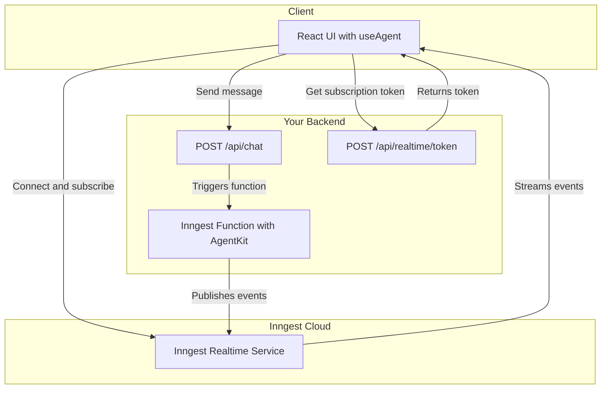

# Transport

> A deep dive into the transport layer for streaming agents

AgentKit's UI streaming is designed to be transport-agnostic, giving you the flexibility to use different real-time communication strategies. At its core, AgentKit doesn't manage WebSocket connections or push data to clients directly.

Instead, it provides a powerful `streaming` configuration hook where you provide a `publish` function. AgentKit calls this function with structured data chunks as your agent network executes, and you decide how to send that data to the client.

This decoupled design means you can use any streaming provider that fits your needs.

## Default Transport: Inngest Realtime

For most applications, we recommend using **Inngest Realtime** as the transport layer. It's robust, scalable, and integrates seamlessly with Inngest's durable function execution, providing a resilient and reliable streaming experience.

### How It Works

The data flow with Inngest Realtime involves a few key components on your backend:

1. **Chat Route (`/api/chat/route.ts`)**: A standard API endpoint that receives a message from your UI and sends an event to Inngest to trigger an agent run.
2. **Token Route (`/api/realtime/token/route.ts`)**: A secure endpoint that generates a short-lived subscription token for the client. The client uses this token to connect to a specific Inngest Realtime channel.
3. **Inngest Function**: The function that runs your agent or network. You pass Inngest's `publish` function to AgentKit's `streaming.publish` hook. AgentKit generates the events, and Inngest handles the delivery to the subscribed client.

Here's a look at the end-to-end flow:



## Session Transport (In-Memory)

For demos, tutorials, or ephemeral chat experiences where you don't need to persist conversation history, you can use the session transport.

This is a **client-side transport** that manages threads and messages for the current browser tab.

It's important to understand that the session transport still relies on the default HTTP transport to communicate with your backend to initiate agent runs. It doesn't change how the server-side streaming works; it only affects how the conversation history is stored on the client.

This is useful for:

* Building live playgrounds of your agents.
* Creating temporary chat sessions that are discarded when the browser tab is closed.
* Reducing database load for non-essential conversations.

## Other Transports

Because of its decoupled design, you can integrate AgentKit with any real-time provider. To do so, you would create your own `publish` function that sends the event chunks from AgentKit to your provider of choice.

## Overriding Transport Methods

You can override any of the default transport's methods or properties by passing a configuration object to the `transport` prop on either the `AgentProvider` or the `useAgent` hook. This is useful for customizing API endpoints, adding authentication headers, or modifying the request body.

If you provide a partial configuration, it will be merged with the default transport configuration.

### Example: Customizing API routes, headers, and body

```tsx
import { AgentProvider } from "@inngest/use-agent";

function App({ userId, getAuthToken, getTenantId }) {
  return (
    <AgentProvider
      userId={userId}
      transport={{
        // Use a different base URL for all API calls
        baseURL: 'https://api.example.com/v2',

        // Override the default API endpoints
        api: {
          sendMessage: '/chat',
          fetchThreads: '/threads'
        },
        
        // Add dynamic Authorization header to all requests
        headers: () => ({
          'Authorization': `Bearer ${getAuthToken()}`,
        }),

        // Add a tenantId to the body of all requests
        body: () => ({
          tenantId: getTenantId(),
        })
      }}
    >
      <ChatApp />
    </AgentProvider>
  );
}
```

## Transport API Reference

The `IClientTransport` interface defines the methods that a transport must implement. Here is a reference for each method and its associated data structures.

### `sendMessage(params, options?)`

Sends a message from the user to the agent.

* `params`: `SendMessageParams`
  * `userMessage`: `object`
    * `id`: `string` - A unique client-generated ID for the message.
    * `content`: `string` - The text content of the user's message.
    * `role`: `"user"`
    * `state?`: `Record<string, unknown>` - Optional client-side state to persist with the message.
    * `clientTimestamp?`: `Date` - The timestamp from when the user sent the message.
    * `systemPrompt?`: `string` - An optional system prompt to override the agent's default.
  * `threadId`: `string` - The ID of the conversation thread.
  * `history`: `unknown[]` - The current conversation history from the client.
  * `userId?`: `string` - The ID of the user.
  * `channelKey?`: `string` - The key for a collaborative channel.
* `options?`: `RequestOptions`
* **Returns**: `Promise<{ success: boolean; threadId: string }>`

### `getRealtimeToken(params, options?)`

Fetches a token for connecting to the real-time service.

* `params`: `GetRealtimeTokenParams`
  * `userId?`: `string`
  * `threadId?`: `string`
  * `channelKey?`: `string`
* `options?`: `RequestOptions`
* **Returns**: `Promise<RealtimeToken>`
  * `token`: `string` - The subscription token.
  * `expires?`: `number` - Optional expiration timestamp.
  * `channel?`: `string` - Optional channel information.

### `fetchHistory(params, options?)`

Fetches the message history for a specific thread.

* `params`: `FetchHistoryParams`
  * `threadId`: `string`
* `options?`: `RequestOptions`
* **Returns**: `Promise<unknown[]>` - An array of message objects.

## Experimental Methods

### `fetchThreads(params, options?)`

Fetches a paginated list of conversation threads.

* `params`: `FetchThreadsParams`
  * `userId?`: `string`
  * `channelKey?`: `string`
  * `limit?`: `number`
  * `cursorTimestamp?`: `string`
  * `cursorId?`: `string`
  * `offset?`: `number`
* `options?`: `RequestOptions`
* **Returns**: `Promise<ThreadsPage>`
  * `threads`: `Thread[]` - An array of thread objects.
  * `hasMore`: `boolean` - Indicates if more pages are available.
  * `total`: `number` - The total number of threads.

### `createThread(params, options?)`

Creates a new conversation thread.

* `params`: `CreateThreadParams`
  * `userId?`: `string`
  * `channelKey?`: `string`
  * `title?`: `string`
  * `metadata?`: `Record<string, unknown>`
* `options?`: `RequestOptions`
* **Returns**: `Promise<{ threadId: string; title: string }>`

### `deleteThread(params, options?)`

Deletes a conversation thread.

* `params`: `DeleteThreadParams`
  * `threadId`: `string`
* `options?`: `RequestOptions`
* **Returns**: `Promise<void>`
